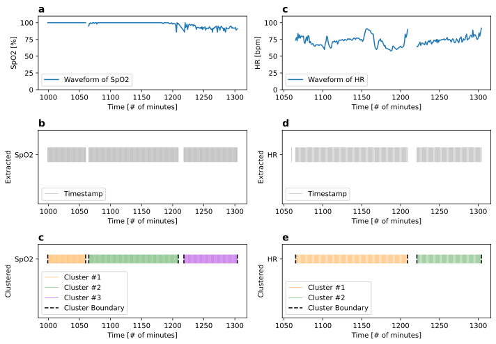

# MESO: A Multi-Participant Spatio-Temporal Event Stream Dataset in Operating Room from Two Tertiary Hospitals in China

This repository contains the data processing pipeline and analysis code for *MESO: A Multi-Participant Spatio-Temporal Event Stream Dataset in Operating Rooms from Two Tertiary Hospitals in China
(in submission)*.


## Environment Setup

This study employs Python for computational reproducibility. To replicate the analysis, execute the following steps:

```bash
# Create a conda virtual environment with Python 3.11
conda create -n meso python=3.11

# Activate the created environment
conda activate meso

# Install the necessary dependencies
python -m pip install -r requirements.txt
```

## Folder Structure

Prior to conducting the analysis, users must download the dataset from the designated [figshare]() repository. The downloaded data files should be placed in the project's `data` folder, resulting in the following directory structure:

```
data/
├── meso-sah-event-2023.json
├── meso-sah-event-2023.pkl
├── meso-sah-metadata-2023.csv
├── meso-xph-event-2023.json   
├── meso-xph-event-2023.pkl     
├── meso-xph-metadata-2023.csv 
├── sample-physiology-waveform-Hr.csv
└── sample-physiology-waveform-SpO2.csv

meso/
├── MESO_validate.ipynb
└── event_extract_from_phy.ipynb

figures/
├── meso-clustering_process.pdf
├── meso-duration-distribution.pdf     
├── meso-heatmap-start-end-time.pdf    
├── meso-inter-event-time-ccdf.pdf        
├── meso-inter-event-time-distribution.pdf             
├── meso-loop-duration-distribution.pdf 
├── meso-room-diversity-boxplot.pdf
├── meso-shap-importance.pdf
├── meso-starttime-distribution.pdf
└── meso-surgeries-per-day.pdf 
```


## Analysis Reproduction

Following data acquisition and environment configuration, execute the Jupyter notebooks to reproduce all analytical results and figures presented in the paper:

- `event_extract_from_phy.ipynb`: It will use the sample physiology waveform data in the `data` folder.
- `MESO_validate.ipynb`: It will use the publish MESO data files.




## Citation

We kindly request that users acknowledge this work by citing:

- The original paper (if being accepted):

```

```

- The figshare dataset repository:

```
@misc{chen_2025, 
    title={MESO: A Multi-Participant Spatio-Temporal Event Stream Dataset in Operating Room from Two Tertiary Hospitals}, 
    url={https://figshare.com/collections/_/7813193/0}, 
    publisher={figshare}, 
    author={Chen, Yixian}, 
    year={2025}, 
    month={Jun} 
}
```

- This codebase:

```
@misc{meso2025yxnchen,
	author = {Chen, Yixian},
	title = {{G}it{H}ub - yxnchen/sd-meso: {M}{E}{S}{O}: {A} {M}ulti-{P}articipant {S}patio-{T}emporal {E}vent {S}tream {D}ataset in {O}perating {R}oom from {T}wo {T}ertiary {H}ospitals --- github.com},
	howpublished = {\url{https://github.com/yxnchen/sd-meso}},
	year = {2025}
}
```
when using these resources for publications or derived works.

